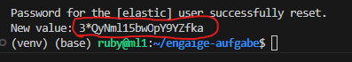

## Anleitung zum Ausführen

### 1. Elasticsearch pullen und im Docker-Container starten
```
docker run --name elastic-rag-01 -d -e "discovery.type=single-node" -p 9200:9200 docker.elastic.co/elasticsearch/elasticsearch:8.14.1
```

### 2. Das Passwort des Elasticsearch-Nutzers neu setzen, ggf. muss kurz gewartet werden.
```
docker exec -it elastic-rag-01  /usr/share/elasticsearch/bin/elasticsearch-reset-password -u elastic
```

### 3. Das neue Passwort in der "credentials.yaml" einfügen.


### 4. SSL-Zertifikat aus dem Docker-Container kopieren.

```
docker cp elastic-rag-01:/usr/share/elasticsearch/config/certs/http_ca.crt .
```

### 5. RAG starten
```
python3 main.py
```